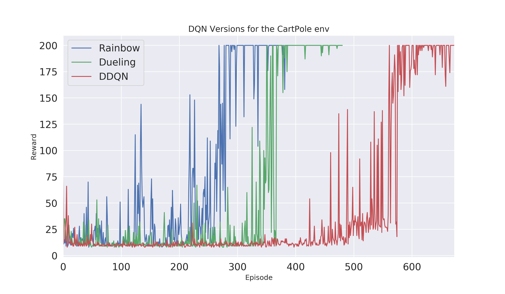
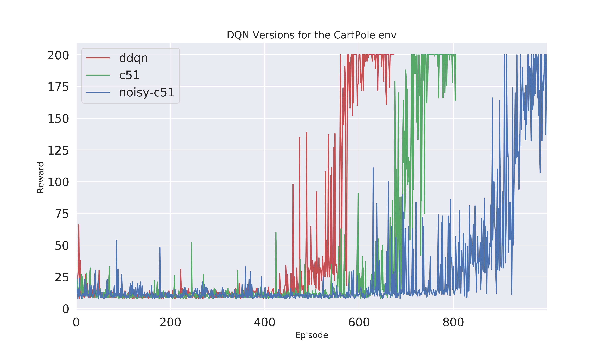

## DQN-Atari-Agents
Modularized training of different DQN Algorithms.

This repository contains several Add-ons to the base DQN Algorithm. All versions can be trained from one script and include the option to train from raw pixel or ram digit data. 

Following DQN versions are currently included:

- DDQN
- Dueling DDQN

Both can be enhanced with **Noisy layer**, **Per** (Prioritized Experience Replay), **Multistep Targets** and be trained in a **Categorical version (C51)**.

#### Planned Add-ons:
- DRQN (recurrent DQN)
- Curiosity Exploration
- Novelty Exploration

## Train your Agent:
To train the base DDQN simply run ``python run_atari_dqn.py``
To train and modify your own Atari Agent the following inputs are optional:

*example:* ``python run_atari_dqn.py -env Breakout-v0 -agent dueling -u 1 -eps_frames 100000 -seed 42 -info Breakout_run1``
- agent: Specify which type of DQN agent you want to train, default is DQN - baseline! **Following agent inputs are currently possible:** ``dqn``, ``dqn+per``, ``noisy_dqn``, ``noisy_dqn+per``, ``dueling``, ``dueling+per``, ``noisy_dueling``, ``noisy_dueling+per``, ``c51``, ``c51+per``, ``noisy_c51``, ``noisy_c51+per``, ``duelingc51``, ``duelingc51+per``, ``noisy_duelingc51``, ``noisy_duelingc51+per``, ``rainbow``
- env: Name of the atari Environment, default = Pong-v0
- frames: Number of frames to train, default = 5 mio
- seed: Random seed to reproduce training runs, default = 1
- bs: Batch size for updating the DQN, default = 32
- layer_size: Size of the hidden layer, default=512
- n_step: Number of steps for the multistep DQN Targets 
- m: Replay memory size, default = 1e5
- u: Update the network every x steps, default = 4
- lr: Learning rate, default = 0.00025
- g: Discount factor gamma, default = 0.99
- t: Soft update parameter tat, default = 1e-3
- eps_frames: Linear annealed frames for Epsilon, default = 2e5
- min_eps: Epsilon greedy annealing crossing point. Fast annealing until this point, from there slowly to 0 until the last frame, default = 0.1
- info: Name of the training run.
- fill_buffer: Adding samples to the replay buffer based on a random policy, before agent-env-interaction. Input numer of preadded frames to the buffer, default = 50000
- save_model: Specify if the trained network shall be saved [1] or not [0], default is 0 - not saved!

#### Training Progress can be view with Tensorboard
Just run ``tensorboard --logdir=runs/``

## Convergence prove for the CartPole Environment
Since training for the Algorithms for Atari takes a lot of time I added a quick convergence prove for the CartPole-v0 environment. You can clearly see that Raibow outperformes the other two methods Dueling DQN and DDQN.

To reproduce the results following hyperparameter where used:
- batch_size: 32
- seed: 1
- layer_size: 512
- frames: 30000
- lr: 1e-3
- m: 500000
- g: 0.99
- t: 1e-3
- eps_frames: 1000
- min_eps: 0.1
- u: 1
- fill_buffer: 50000

Its interesting to see that the add-ons have a negative impact for the super simple CartPole environment. Still the Dueling DDQN version performs clearly better than the standard DDQN version.

## Help and issues:
Im open for feedback, found bugs, improvements or anything. Just leave me a message or contact me.

### Paper references:

- [DQN](https://arxiv.org/abs/1312.5602)
- [Dueling DQN](https://arxiv.org/abs/1511.06581)
- [Noisy layer](https://arxiv.org/pdf/1706.10295.pdf)
- [C51](https://arxiv.org/pdf/1707.06887.pdf)
- [PER](https://arxiv.org/pdf/1511.05952.pdf)
- [Rainbow](https://arxiv.org/pdf/1710.02298.pdf)
- [DRQN](https://arxiv.org/abs/1507.06527)
